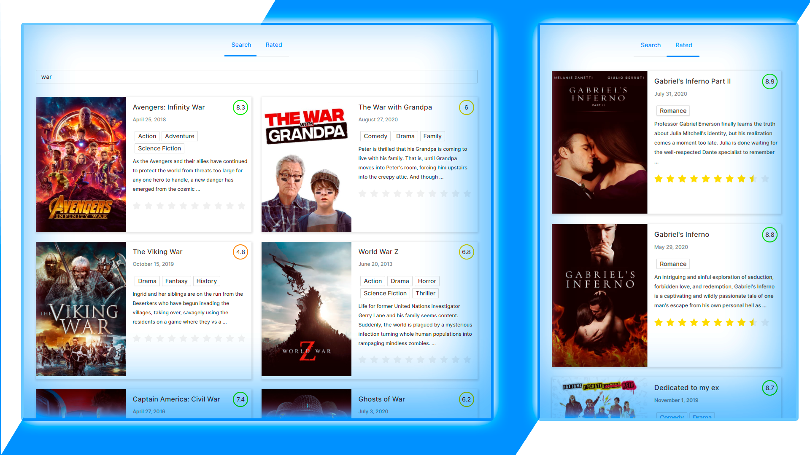

# React Movie Application

The way it look's like 👇🏼



# Try it 👇
https://movies-app-ruby.vercel.app/

# How to use it ?
 - Open the terminal and run ```npm install``` command to install the project
 - Then run ```npm run start``` in order to run the project on a loaclhost:3000
 
### That's all :D

Fell free to use It !

(c) 2020 LakerShot

